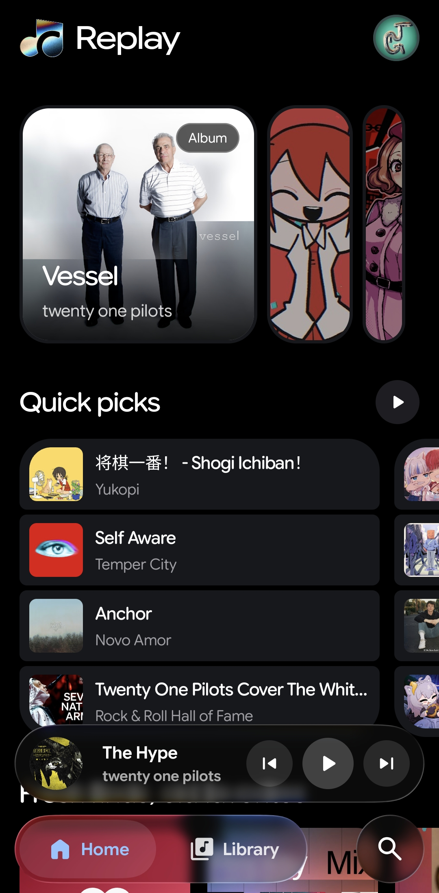
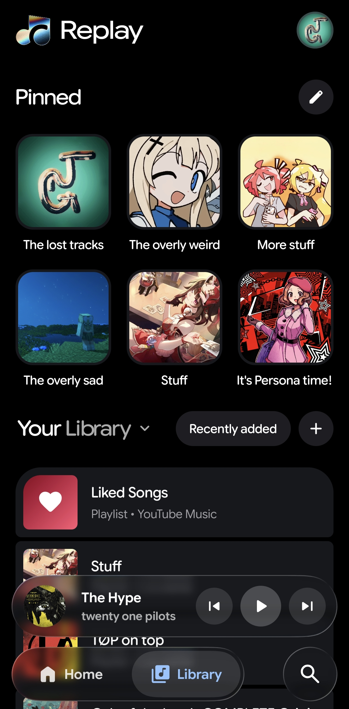
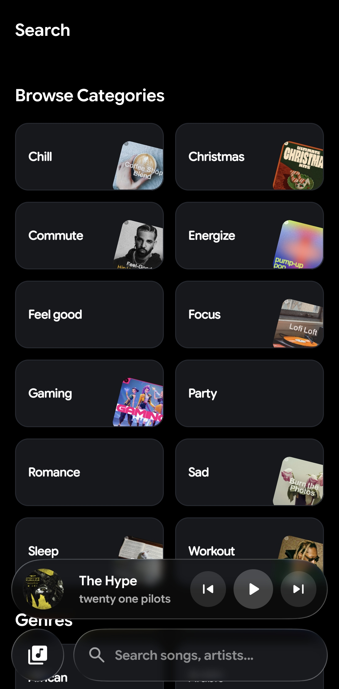
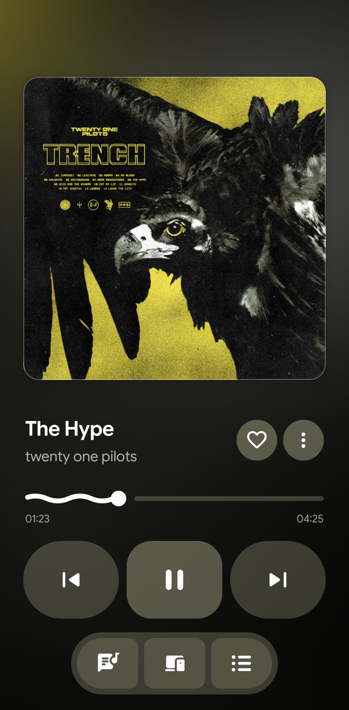

# Replay

  
  
  
  

Replay is a fork of [SimpMusic](https://github.com/maxrave-dev/SimpMusic). Please don't use Replay if you want a stable app with support from the developer. This is mainly a project for myself. Thank you for your understanding!

Feel free to use anything you want from this project. Just make sure to adhere to the license of SimpMusic.
